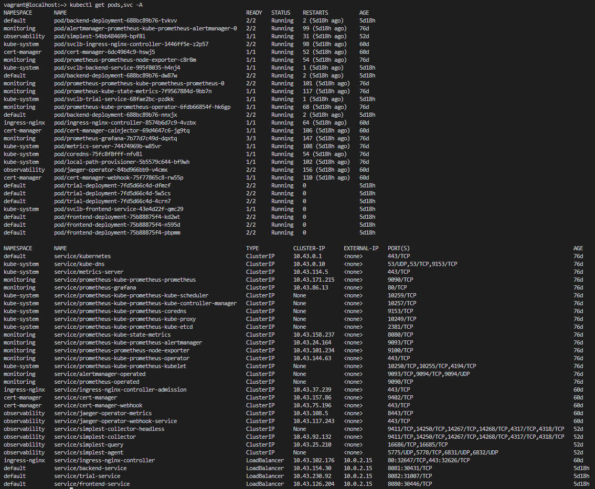
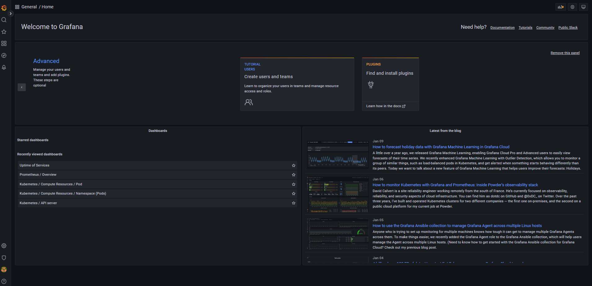
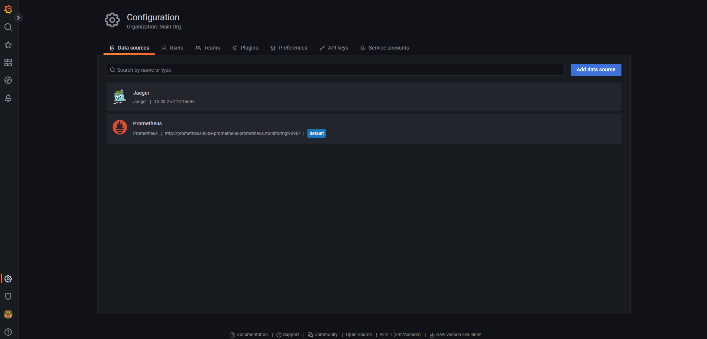

**Note:** For the screenshots, you can store all of your answer images in the `answer-img` directory.

## Verify the monitoring installation

_TODO:_ run `kubectl` command to show the running pods and services for all components. Take a screenshot of the output and include it here to verify the installation

## Setup the Jaeger and Prometheus source

_TODO:_ Expose Grafana to the internet and then setup Prometheus as a data source. Provide a screenshot of the home page after logging into Grafana.

## Create a Basic Dashboard

_TODO:_ Create a dashboard in Grafana that shows Prometheus as a source. Take a screenshot and include it here.

## Describe SLO/SLI

_TODO:_ Describe, in your own words, what the SLIs are, based on an SLO of _monthly uptime_ and _request response time_.

<table>
<tr><th>SLO</th><th>SLI</th><th>Description</th><th>Quantification</th></tr>
<tr><td rowspan="2">monthly uptime</td><td>availability</td><td>the fraction of time within a month that the service is usable</td><td>99.95% - "3 and a half nines" statuses will be 20x in a month</td></tr><tr><td>error rate</td><td>the fraction of requests with error response</td><td>0.05% error budget</td></tr>
<tr><td rowspan="4">request response time</td><td>request latency</td><td>the time it takes to return a response to a request</td><td>99% responses <= 100 milliseconds</td></tr><tr><td>CPU capacity</td><td>the percentage of CPU used</td><td>[Subject to the services used and their use cases]</td></tr><tr><td>Memory capacity</td><td>the percentage of memory used</td><td>[Subject to the services used and their use cases]</td></tr><tr><td>system throughput</td><td>the number of requests per second</td><td>[Subject to the services used and their use cases]<td><tr>
</table>

## Creating SLI metrics.

_TODO:_ It is important to know why we want to measure certain metrics for our customer. Describe in detail 5 metrics to measure these SLIs.

<b>Starting with simple metrics</b>

<table>
<tr><th>SLI</th><th>Description</th><th>Details</th><th>Why?</th></tr>
<tr><td>availability</td><td>the fraction of time within a month that the service is usable</td><td>the number of HTTP 20x responses in a month <b>over</b> the number of all HTTP responses in a month</td><td>This helps us prove that we are meeting our SLOs</td></tr>
<tr><td>error rate</td><td>the fraction of requests with error response</td><td>the number of HTTP 40x + 50x responses in a month <b>over</b> the number of all HTTP responses in a month</td><td>This helps us punctually address any deviations from our SLOs</td></tr>
<tr><td>request latency</td><td>the time it takes to return a response to a request</td><td>the time in milliseconds it takes for a request to the backend service to return a response to the frontend service. The entry point is the <b>first request</b> sent by the client to a backend service for a unit of work to start. The <b>response</b> is the final output of the unit of work performed.</td><td>This helps us punctually address any deviations from our SLOs</td></tr>
<tr><td>CPU capacity</td><td>the percentage of CPU used</td><td>the CPU time used by all the backend services <b>over</b> the total CPU time available for all the backend services</td><td>This helps us punctually address any deviations from our SLOs, since this may affect request latency and/or availability</td></tr>
<tr><td>Memory capacity</td><td>the percentage of memory used</td><td>the memory used by all the backend services <b>over</b> the total memory available for all the backend services</td><td>This helps us punctually address any deviations from our SLOs, since this may affect request latency and/or availability</td></tr>
</table>

## Create a Dashboard to measure our SLIs

_TODO:_ Create a dashboard to measure the uptime of the frontend and backend services We will also want to measure to measure 40x and 50x errors. Create a dashboard that show these values over a 24 hour period and take a screenshot.

## Tracing our Flask App

_TODO:_ We will create a Jaeger span to measure the processes on the backend. Once you fill in the span, provide a screenshot of it here. Also provide a (screenshot) sample Python file containing a trace and span code used to perform Jaeger traces on the backend service.

## Jaeger in Dashboards

_TODO:_ Now that the trace is running, let's add the metric to our current Grafana dashboard. Once this is completed, provide a screenshot of it here.

## Report Error

_TODO:_ Using the template below, write a trouble ticket for the developers, to explain the errors that you are seeing (400, 500, latency) and to let them know the file that is causing the issue also include a screenshot of the tracer span to demonstrate how we can user a tracer to locate errors easily.

TROUBLE TICKET

Name:

Date:

Subject:

Affected Area:

Severity:

Description:

## Creating SLIs and SLOs

_TODO:_ We want to create an SLO guaranteeing that our application has a 99.95% uptime per month. Name four SLIs that you would use to measure the success of this SLO.

## Building KPIs for our plan

_TODO_: Now that we have our SLIs and SLOs, create a list of 2-3 KPIs to accurately measure these metrics as well as a description of why those KPIs were chosen. We will make a dashboard for this, but first write them down here.

## Final Dashboard

_TODO_: Create a Dashboard containing graphs that capture all the metrics of your KPIs and adequately representing your SLIs and SLOs. Include a screenshot of the dashboard here, and write a text description of what graphs are represented in the dashboard.
